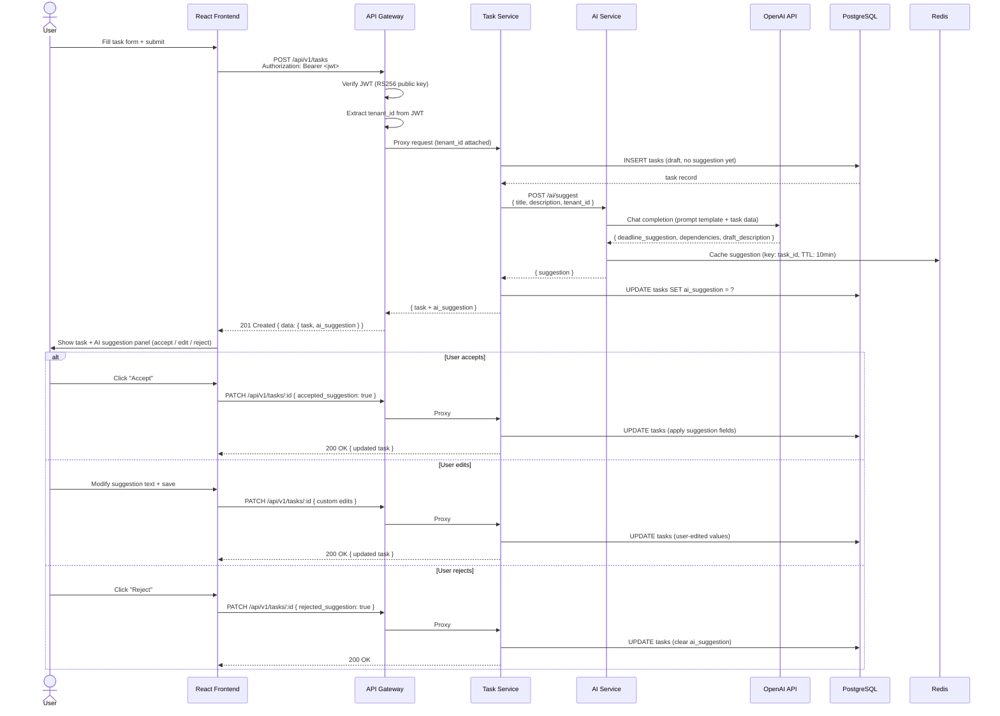
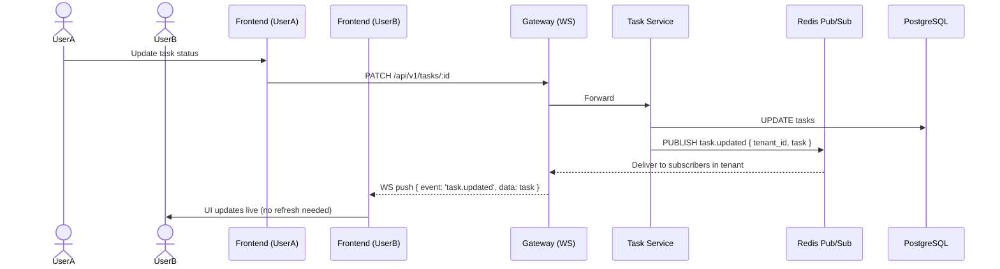
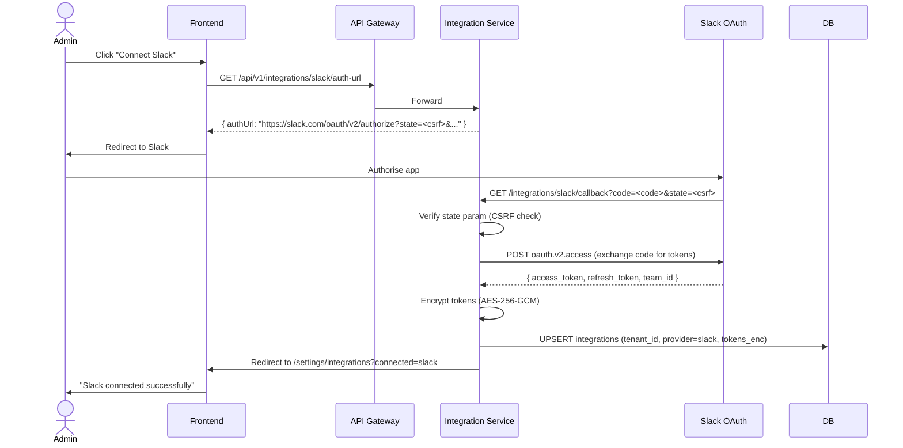

# AI-Assist Sequence Diagrams

## Task Creation with AI Suggestion

```mermaid
sequenceDiagram
  actor User
  participant FE as React Frontend
  participant GW as API Gateway
  participant TS as Task Service
  participant AI as AI Service
  participant OA as OpenAI API
  participant DB as PostgreSQL
  participant RD as Redis

  User->>FE: Fill task form + submit
  FE->>GW: POST /api/v1/tasks<br/>Authorization: Bearer <jwt>
  GW->>GW: Verify JWT (RS256 public key)
  GW->>GW: Extract tenant_id from JWT
  GW->>TS: Proxy request (tenant_id attached)

  TS->>DB: INSERT tasks (draft, no suggestion yet)
  DB-->>TS: task record

  TS->>AI: POST /ai/suggest<br/>{ title, description, tenant_id }
  AI->>OA: Chat completion (prompt template + task data)
  OA-->>AI: { deadline_suggestion, dependencies, draft_description }
  AI->>RD: Cache suggestion (key: task_id, TTL: 10min)
  AI-->>TS: { suggestion }

  TS->>DB: UPDATE tasks SET ai_suggestion = ?
  TS-->>GW: { task + ai_suggestion }
  GW-->>FE: 201 Created { data: { task, ai_suggestion } }

  FE->>User: Show task + AI suggestion panel (accept / edit / reject)

  alt User accepts
    User->>FE: Click "Accept"
    FE->>GW: PATCH /api/v1/tasks/:id { accepted_suggestion: true }
    GW->>TS: Proxy
    TS->>DB: UPDATE tasks (apply suggestion fields)
    TS-->>FE: 200 OK { updated task }
  else User edits
    User->>FE: Modify suggestion text + save
    FE->>GW: PATCH /api/v1/tasks/:id { custom edits }
    GW->>TS: Proxy
    TS->>DB: UPDATE tasks (user-edited values)
    TS-->>FE: 200 OK { updated task }
  else User rejects
    User->>FE: Click "Reject"
    FE->>GW: PATCH /api/v1/tasks/:id { rejected_suggestion: true }
    GW->>TS: Proxy
    TS->>DB: UPDATE tasks (clear ai_suggestion)
    TS-->>FE: 200 OK
  end
```

---

## Real-time Task Update (WebSocket)

```mermaid
sequenceDiagram
  actor UserA
  actor UserB
  participant FE_A as Frontend (UserA)
  participant FE_B as Frontend (UserB)
  participant GW as Gateway (WS)
  participant TS as Task Service
  participant RD as Redis Pub/Sub
  participant DB as PostgreSQL

  UserA->>FE_A: Update task status
  FE_A->>GW: PATCH /api/v1/tasks/:id
  GW->>TS: Forward
  TS->>DB: UPDATE tasks
  TS->>RD: PUBLISH task.updated { tenant_id, task }
  RD-->>GW: Deliver to subscribers in tenant
  GW-->>FE_B: WS push { event: 'task.updated', data: task }
  FE_B->>UserB: UI updates live (no refresh needed)
```

---

## OAuth2 Integration Flow (e.g. Slack)

```mermaid
sequenceDiagram
  actor Admin
  participant FE as Frontend
  participant GW as API Gateway
  participant IS as Integration Service
  participant Slack as Slack OAuth

  Admin->>FE: Click "Connect Slack"
  FE->>GW: GET /api/v1/integrations/slack/auth-url
  GW->>IS: Forward
  IS-->>FE: { authUrl: "https://slack.com/oauth/v2/authorize?state=<csrf>&..." }
  FE->>Admin: Redirect to Slack

  Admin->>Slack: Authorise app
  Slack->>IS: GET /integrations/slack/callback?code=<code>&state=<csrf>
  IS->>IS: Verify state param (CSRF check)
  IS->>Slack: POST oauth.v2.access (exchange code for tokens)
  Slack-->>IS: { access_token, refresh_token, team_id }
  IS->>IS: Encrypt tokens (AES-256-GCM)
  IS->>DB: UPSERT integrations (tenant_id, provider=slack, tokens_enc)
  IS->>FE: Redirect to /settings/integrations?connected=slack
  FE->>Admin: "Slack connected successfully"
```
