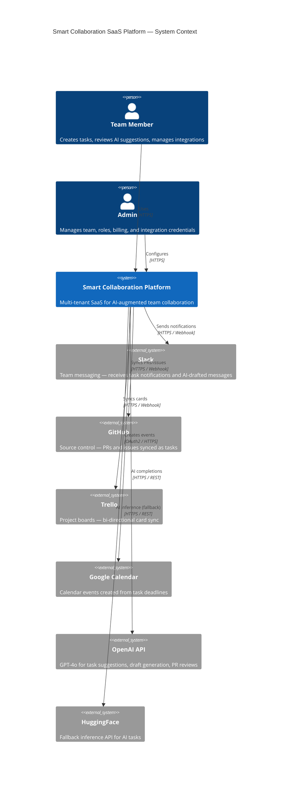
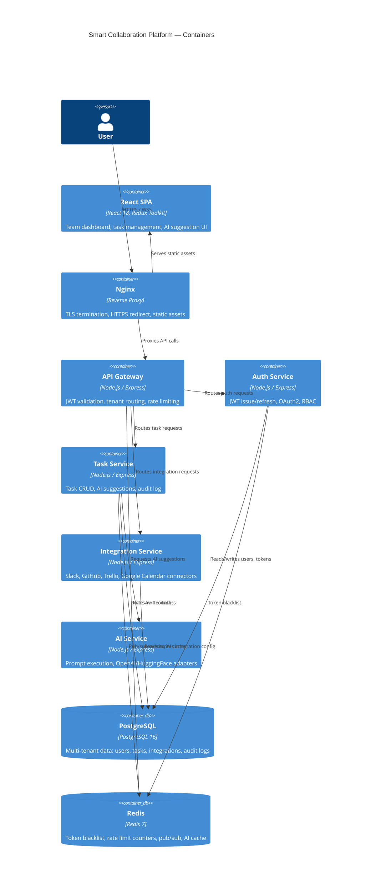
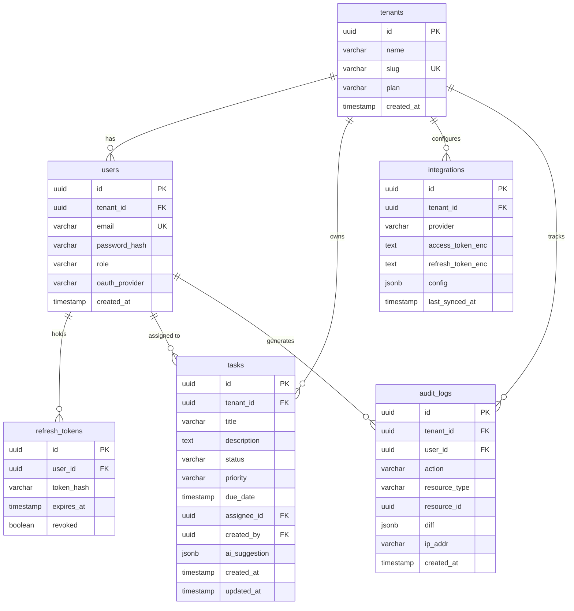

# System Context Diagram

```mermaid
C4Context
  title Smart Collaboration SaaS Platform — System Context

  Person(user, "Team Member", "Creates tasks, reviews AI suggestions, manages integrations")
  Person(admin, "Admin", "Manages team, roles, billing, and integration credentials")

  System(platform, "Smart Collaboration Platform", "Multi-tenant SaaS for AI-augmented team collaboration")

  System_Ext(slack, "Slack", "Team messaging — receives task notifications and AI-drafted messages")
  System_Ext(github, "GitHub", "Source control — PRs and issues synced as tasks")
  System_Ext(trello, "Trello", "Project boards — bi-directional card sync")
  System_Ext(gcal, "Google Calendar", "Calendar events created from task deadlines")
  System_Ext(openai, "OpenAI API", "GPT-4o for task suggestions, draft generation, PR reviews")
  System_Ext(huggingface, "HuggingFace", "Fallback inference API for AI tasks")

  Rel(user, platform, "Uses", "HTTPS")
  Rel(admin, platform, "Configures", "HTTPS")
  Rel(platform, slack, "Sends notifications", "HTTPS / Webhook")
  Rel(platform, github, "Syncs PRs/Issues", "HTTPS / Webhook")
  Rel(platform, trello, "Syncs cards", "HTTPS / Webhook")
  Rel(platform, gcal, "Creates events", "OAuth2 / HTTPS")
  Rel(platform, openai, "AI completions", "HTTPS / REST")
  Rel(platform, huggingface, "AI inference (fallback)", "HTTPS / REST")
```

---

# Container Diagram

```mermaid
C4Container
  title Smart Collaboration Platform — Containers

  Person(user, "User")

  Container(frontend, "React SPA", "React 18, Redux Toolkit", "Team dashboard, task management, AI suggestion UI")
  Container(nginx, "Nginx", "Reverse Proxy", "TLS termination, HTTPS redirect, static assets")
  Container(gateway, "API Gateway", "Node.js / Express", "JWT validation, tenant routing, rate limiting")
  Container(auth, "Auth Service", "Node.js / Express", "JWT issue/refresh, OAuth2, RBAC")
  Container(tasks, "Task Service", "Node.js / Express", "Task CRUD, AI suggestions, audit log")
  Container(integrations, "Integration Service", "Node.js / Express", "Slack, GitHub, Trello, Google Calendar connectors")
  Container(ai, "AI Service", "Node.js / Express", "Prompt execution, OpenAI/HuggingFace adapters")

  ContainerDb(postgres, "PostgreSQL", "PostgreSQL 16", "Multi-tenant data: users, tasks, integrations, audit logs")
  ContainerDb(redis, "Redis", "Redis 7", "Token blacklist, rate limit counters, pub/sub, AI cache")

  Rel(user, nginx, "HTTPS / WSS")
  Rel(nginx, frontend, "Serves static assets")
  Rel(nginx, gateway, "Proxies API calls")
  Rel(gateway, auth, "Routes auth requests")
  Rel(gateway, tasks, "Routes task requests")
  Rel(gateway, integrations, "Routes integration requests")
  Rel(tasks, ai, "Requests AI suggestions")
  Rel(auth, postgres, "Reads/writes users, tokens")
  Rel(tasks, postgres, "Reads/writes tasks")
  Rel(integrations, postgres, "Reads/writes integration config")
  Rel(gateway, redis, "Rate limit counters")
  Rel(auth, redis, "Token blacklist")
  Rel(tasks, redis, "Pub/sub events, AI cache")
```

---

# ERD

```mermaid
erDiagram
  tenants {
    uuid id PK
    varchar name
    varchar slug UK
    varchar plan
    timestamp created_at
  }

  users {
    uuid id PK
    uuid tenant_id FK
    varchar email UK
    varchar password_hash
    varchar role
    varchar oauth_provider
    timestamp created_at
  }

  refresh_tokens {
    uuid id PK
    uuid user_id FK
    varchar token_hash
    timestamp expires_at
    boolean revoked
  }

  tasks {
    uuid id PK
    uuid tenant_id FK
    varchar title
    text description
    varchar status
    varchar priority
    timestamp due_date
    uuid assignee_id FK
    uuid created_by FK
    jsonb ai_suggestion
    timestamp created_at
    timestamp updated_at
  }

  integrations {
    uuid id PK
    uuid tenant_id FK
    varchar provider
    text access_token_enc
    text refresh_token_enc
    jsonb config
    timestamp last_synced_at
  }

  audit_logs {
    uuid id PK
    uuid tenant_id FK
    uuid user_id FK
    varchar action
    varchar resource_type
    uuid resource_id
    jsonb diff
    varchar ip_addr
    timestamp created_at
  }

  tenants ||--o{ users : "has"
  tenants ||--o{ tasks : "owns"
  tenants ||--o{ integrations : "configures"
  tenants ||--o{ audit_logs : "tracks"
  users ||--o{ refresh_tokens : "holds"
  users ||--o{ tasks : "assigned to"
  users ||--o{ audit_logs : "generates"
```
